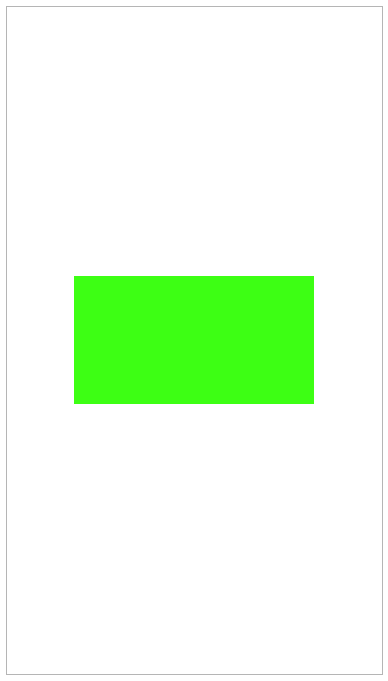
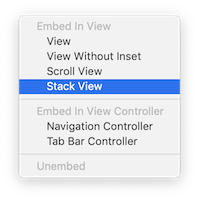

# Week 8 Lab

Comp327 week 8 lab for week commencing 12 November 2018.

## Interface Builder

TL;DR: Interface builder is the tool within Xcode for creating a User Interface via a GUI. 

Interface Builder has been around since 1988, in 2008 a special iPhone version of Interface Builder was released to allow for the building iPhone interfaces. As of Xcode 4 Interface Builder became integrated into Xcode, before this Interface Builder had been its own application.

Sometimes Interface Builder will be refered to as IB. In some cases you may find Interface Builder files called .xib or .nib, this stands for NeXT interface builder dating back to the NeXTSTEP company Steve Jobs created after leaving Apple.

Interface Builder had been used by Tim Berners-Lee to create the WorldWideWeb Browser back in 1990.

## Storyboards

In previous versions of Xcode, a .nib files would be required for each View Controller, As of Xcode 4.2 Storyboards have been available.

One of the notable advantages of Storyboards is *Segues*, Segues allow for linking of View Controllers to other View Controllers within Interface Builders GUI. Previously linking View Controllers would have to be done via code, it is worth noting that you can still link View Controllers together with Code.

## Views

When creating an Interface in Interface Builder, most of the time a View will be used. A View inherits or directly implements the `UIView` Class. A View on the Interface Builder is a rectangular area the handles drawing and touch/gesture events.

Most Objects in the Object library inherit from`UIView`, e.g. Button, TextField, Slider, ...

Views can and are typically nested, i.e. a View sits inside another View. The relationship between nested Views are described as a SuperView and a SubView, the Super being the outer and the Sub being the Inner.

## Auto Layout

Auto Layout is a dynamic way of describing layouts of Views. This can be particularly helpful for designing interfaces that work well on all sizes of the iPhone, with Auto Layout the same described layout can be made to run well on a 4 inch screen threw to a 5.8 inch screen.

Auto Layout is a system of *Constraints* defining size and position of Views within their relative SuperView.

### Getting Started with Auto Layout

Within Interface Builder, the toolbar at the bottom of the editor is where the Auto Layout Menus and Options can be found.

On the left side of the toolbar is the device that the editor is currently displaying, you can change the device to see how the interface will look. Clicking on the current device brings up the options for changing device and Orientation of the device.

Next to the iPhone device is the Size Class of the selected device in its orientation, for the iPhone 8 in portrait it is wC hR. This means, compact width and regular height. Changing the device to landscape results in the height becoming compact. Size classes can be used to alter the constraints applied to the Views.

On the left side of the toolbar, a collection of menu's and buttons can be found, from left to right:

- Update Frames, updates the view displayed on the editor with the current constraints applied
- Embed in stack, this will place the selected views inside a Stack View
- Alignment constraints
- Height and Position constraints
- Resolve auto layout issues button

###Height and Position Constraints

Starting with Height and Position constraints or "A new layout constraint". 

A new constraint can have a defined height and width, spacing to nearest neighbour and some additional constraints to be discussed later.

###Alignment Constraints

Alignment constraints allow for positioning views aligned with one another. 

To activate this option, you need to `command` + `click` at least two Views from the left side toolbar.

### Safe Area

Since Xcode 9 the *Safe Area* Layout Guide is available, think of this as a set of margins in which it is safe to draw content within. 

To further illustrate, here is a View Controller root View with a background of Green and a subview that has been given a 0 point positioning to the layout guide edges. 

The sub View has a black background, here is the layout shown in Portrait

As shown, the green colour around the edges of the back sub View indicates the Safe Layout Guide, here is the same View in Landscape

The safe area on the iPhone X does not encroach on home button and the *notch*, on the iPhone 8 the safe area is aligned to the edge of the device on the left, bottom and right sides. On the top side when the Top Bar is present, the safe area will be below this.

The safe area will also change when a Bottom Tab Bar or Navigation Bar is present.

### Aligning to Centres of Views

To centre a View within its Superview, the alignment constraint can be used. This constrain in located within the alignment constraint menu.

When the device is rotated to landscape, the button will still be in the middle of the Superview.

### Relative Heights and Widths

A height or width can be set to relate to another views height or width, to do this both views need to be selected in the left toolbar and a constraint applied in the Constraints Menu.

For example, a View inside a root View where the sub view is called `GreenView`

In the example the `GreenView` will have the same width as the root View and half the height of the root View. The `GreenView` will be zero aligned to the top and trailing Safe Area.

Take care to select both the Safe Area and `GreenView` then click "Add 1 Constraint" to add the Constraint.

To set the height as half the width of the safe area, repeat the width constraint but for Equal Heights, then in the right side drawer under the Attribute Inspector ![][attribute-inspector] set the *Multiplier* to be `0.5`.

**Task 1**

Create a new Project called LayoutApp1, implement the above example applying all constraints, however have the `GrenView` aligned to the bottom of the Safe Area. Test to make sure that the project works in landscape and portrait.

Example of the completed view:

### Size Class Variation

In some cases constraints may differ between size classes, for example in landscape a constraint may not be needed or should differ from than in portrait.

In this example, we shall work with the last task. In portrait the height should be equal to half, however in landscape the height should be equal.

This can be achieved by adding a size class variation to the Equal Height Constraint. In the left side editor drawer click on the `GreenView.height = 0.5 × Safe Area.height` constraint, in the right side drawer under the Attribute inspector notice that the constraint is *Installed*, unticking this option uninstalls the constraint. To the left is a `+` button, clicking on the button brings up the option to add a Variation based on the height, width and Gamut. Selecting Width: Any, Height: Regular will introduce the variation we need. 

Notice the constraint has been uninstalled and Installed for hR, this means the constraint will any apply to regular heights only.

On the iPhone all devices in Portrait have the Size class of hR wC and in landscape hC wC.

Setting the height of `GreenView` to be equal to the superview in landscape can be achieved by having two constraints with different variations.

**Task 2** 

Create a new project called LayoutApp2, implement the above example about applying all constraints However in landscape have the `GreenView` width to be half Safe Area width and in portrait have the widths be equal. The `GreenView` should be Zero Aligned on the top, leading and bottom to the safe area. Test to make sure that the project works in landscape and portrait.

### Stack Views

Stack views allows for creating more complicated layouts quicker and easier.

Consider the above layout, to draw this layout using Alignment and Equal Height Constraints would require the following:

1. Equal Heights for each view
2. A view with a relative height to the Safe Area
3. Width Constraint for each View
4. Leading Each Constraint
5. Vertical Space Constraints for each view
6. any probably some more...

If after creating these constraints another View needed to be added to the layout, it would not be simple; this is where Stack Views come in.

Stack Views have the following properties:

**Alignment**

How each view is aligned to each edge

**Axis**

How the views within the Stack View are *Stacked*, this can be horizontally (side by side) or vertically (on top of each other)

**Spacing**

How much space is between each of the Views

**Distribution**

How each View will fill the available space within the Stack View

To create the above example, three Views will be placed onto a root view, theses sub Views are called `GreenView`, `RedView` and `BlueView`. 

To place the Views within a Stack View, select them using `cmd` + `click` and click on the Stack View option in the bottom toolbar (circled in the image above), click the stack view option, then the three Views are now sub Views of a Stack View.

In the Attribute inspector of the Stack View you can see the axis, alignment, distribution and spacing properties.

**Task 3**

Create a new project called LayoutApp3, implement the above example, in addition figure out how to add the following:

- Zero Top, Bottom, Leading and Trailing edge constraints on the StackView to the Safe Area

- Distribute the Views equally so that each View has equal height

- Introduce 10 point spacing between the Views

- Add a Variation on the Axis so that in landscape the views are Horizontal

  ​

Test to make sure that the project works in landscape and portrait, and respects the Safe Area.

### Intrinsic Size

Sometimes the size of Views isn't always known before runtime, for example, when downloading information from the internet or localised strings.

This can be achieved using *Intrinsic Content Size*, the intrinsic content size is dynamic and will be calculated at runtime; this is an *implicit* constraint verses the *explicit* constraints described above.

Not every view has intrinsic content sizing, such as the `UIView` class, however `UILabel` and `UIImageView` do, allowing for downloading of variable length strings and images of differing dimensions from the internet to be able to render correctly at runtime.

### Content Hugging & Content Compression Resistance Priority

Intrinsic content sizes can conflict with other intrinsic content size views, for example, multiple `UILabel` instances stacked horizontally. In this scenario, which label gets "Priority".

A views priority can be described two ways, first by using the **Content Hugging** priority, which says that a view may not grow and is "Hugged". With a higher priority, the more resistance to growth beyond the intrinsic size is applied to the view.

The second, **Compression Resistance** priority which describes how the view will "Resist" being compressed by other views intrinsic size. The higher the priority, the more the view will resist being compressed or "made smaller" than its intrinsic size and express a desire to grow.

Both the intrinsic size and the priorities can be found in the size inspector ![][size-inspector] in the right side drawer.

The content compression resistance priority can be set to any value, however Xcode gives three suggested values:

- 1000 being required priority
- 750 being high priority
- 250 being low priority

The same is true for content hugging priorities.

An **example** use case could be a login screen that would typically comprising of two textfields and labels, one pair for the username and another for the password. The labels should start about 25 points from the leading edge and have some 10 points spacing before the textfield begins, then the textfield should end 25 points from the trailing edge. However, the textfields should be the same width.

The following constraints allow us to achieve this:

1. Username label leading = Safe area leading + 25
2. Username textfield leading = Username label trailing  + 10
3. Safe area trailing = Username textfield trailing  + 25

To have the text of the label and textarea be level with each other, `alt` + `click` the label and text area and align to baseline.

Repeat these steps for the password label and textfield.

To ensure that the textfield have the same width, `alt` + `click` both textfields to select them both and give them an equal width constraint.

Finish by adding relevant top constraints.

**Task 4**

Complete the example above, test to make sure that the project works in landscape and portrait, respects the Safe Area and displays correctly on the iPhone 8 Plus and iPhone SE.

## Localisation

The localisation feature within Xcode allows an App to support other languages. When designing an App the first language used to design the interface is known as the base language, once the interface has been designed localisation work typically starts. This is where you can add additional language support such as French, there is no limit on the number of languages you can support.

To add localisation support to a project, head over to the project root in the left drawer, click on the project in the editor and select the info tab. Once here scroll down to the localisations header.

Click on the `+` button to add another language, In this example the French Language will be added. At the next dialog click Finish.

You now have another language supported but not translated. To start adding additional french words to your storyboard, enable localisation on the storyboard by opening the storyboard in the editor and ticking the french option in the right drawer under the file tab .

In the left drawer on the storyboard file, a folder has opened up showing a Main.strings (French) file, click on this and change the username and password to their French versions.

Username is "Nom d'utilisateur" and password is "Mot de passe".

To test to make sure that the localisation work has been completed, `alt` + `click` on the simulator device on the toolbar and change the application language to French.

If the intrinsic size has set up the correctly, the label and textfield widths will automatically change to accommodate the content.

Hint: If you create additional objects on the storyboard after you have generated the localized file, those new objects won't appear. You can regenerate the file in the left hand drawer, changing it from "Localisable Strings" to "Interface Builedr Storyboard" and back to "Localizable Strings".

**Task 5** 

> Task 5 is the optional extra step that’s worth an extra point when this is submitted as part of the portfolio

Create a login screen consisting of:

- Username Label
- Password Label
- Username Textfield
- Password Textfield
- Login Button
- View with all the above inside

The textfields should be of equal width, have relevant constraints and be of a **desired** width of 200 points, the login button should be centred, the labels should expand based on their content size and have baseline alignment with their paired textfield.

The View should be centred vertically and horizontally with a constraint saying it **must not** be any closer than 30 points to the trailing edge of the superview. This means that width of the textfield will be of lesser priority than the trailing edge constraint. The height should be automatically set by using 10 point top constraints between all the items inside the view.

Add French localisation to the storyboard using the French word "s'identifier" for login. Finish by testing the App in two iPhone sizes and both languages.

Example of the App running on the iPhone SE

 

Example of the App running on the iPhone 8 plus

Hint:

[attribute-inspector]: images/attribute-inspector.png

[size-inspector]:images/size-inspector.png

